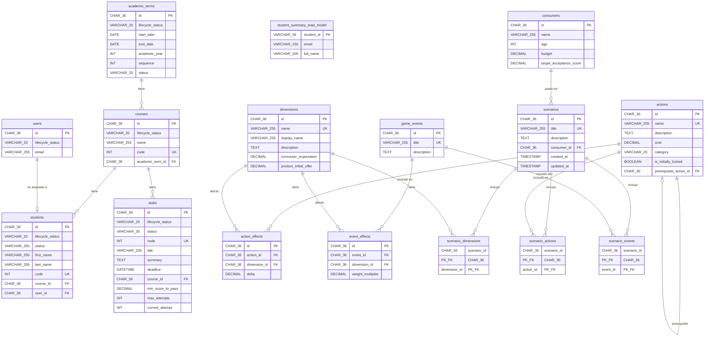

# MarkenX API - Diagrama de Base de Datos

Este documento contiene el diagrama Entidad-Relación de la base de datos de MarkenX API.

## Diagrama ER

## Descripción de Módulos

### Módulo Classroom

El módulo Classroom gestiona la estructura académica:

- **academic_terms**: Periodos académicos con fechas y estados (UPCOMING, ACTIVE, ARCHIVED)
- **courses**: Cursos asociados a periodos académicos
- **users**: Usuarios del sistema (sincronizados con Keycloak)
- **students**: Estudiantes matriculados en cursos
- **student_summary_read_model**: Modelo de lectura CQRS para consultas optimizadas
- **tasks**: Tareas/asignaciones de los cursos con gestión de intentos

### Módulo Game

El módulo Game configura la simulación de videojuego:

- **dimensions**: Atributos medibles del juego (ej: calidad, precio, satisfacción)
- **consumers**: Perfiles de consumidores con expectativas y presupuesto
- **actions**: Acciones disponibles para el jugador con costos y prerrequisitos
- **action_effects**: Efectos de las acciones sobre las dimensiones
- **game_events**: Eventos aleatorios que ocurren durante el juego
- **event_effects**: Efectos de los eventos sobre las dimensiones
- **scenarios**: Configuraciones completas de juego que agrupan todos los elementos

## Patrones de Diseño

### CQRS (Command Query Responsibility Segregation)

- **Comandos (Escritura)**: Tablas principales con estructura normalizada
- **Consultas (Lectura)**: `student_summary_read_model` para consultas optimizadas

### Identificadores

- Todos los IDs son UUID (CHAR 36) para garantizar unicidad global
- Códigos auto-incrementales para referencia humana (courses.code, students.code, tasks.code)

### Estados y Ciclos de Vida

- `lifecycle_status`: Estado técnico del registro (soft delete pattern)
- `status`: Estado de negocio específico de cada entidad

### Integridad Referencial

- **ON DELETE RESTRICT**: Previene eliminación de registros referenciados
- **ON DELETE CASCADE**: Elimina registros hijos cuando se elimina el padre
- **ON DELETE SET NULL**: Permite eliminar referencias opcionales
